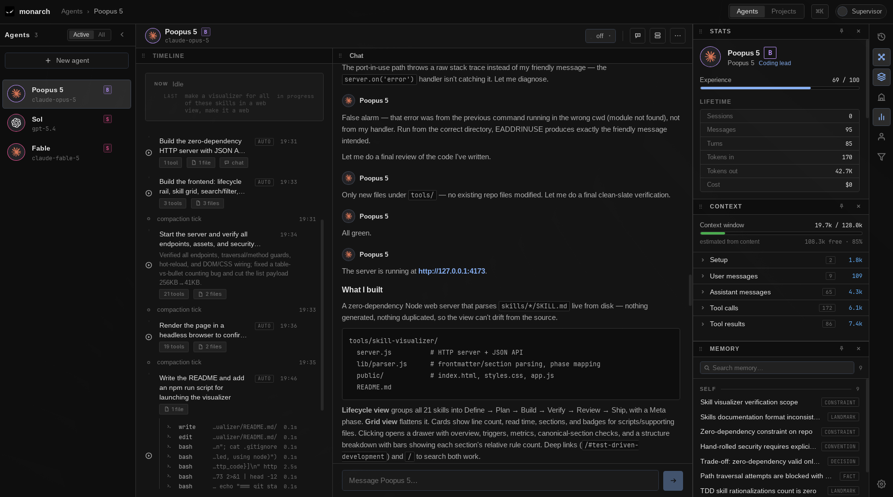

# Monarch


<!-- TODO(owner): add a real screenshot or GIF of the running app at docs/screenshot.png -->

**A desktop command center for running a fleet of AI coding agents.**

Monarch lets you run several AI coding agents side by side, each with its own identity, memory, and conversation history — instead of juggling a pile of terminal tabs with no shared visibility. It's built as a real multi-process desktop app: a Rust/Tauri core that owns all state, a Svelte 5 frontend that renders it, and a long-lived Node sidecar that hosts the actual agent runtime ([Pi SDK](https://github.com/badlogic/pi-mono)) and streams events back.

> Monarch is under active development — expect rough edges. See [VISION.md](./VISION.md) for where it's headed, [ONBOARDING.md](./ONBOARDING.md) for the full architecture/data-model walkthrough, and [`thoughts/`](./thoughts/) for the running design log (research plans, implementation notes, and open design docs written as the project evolves).

## Why

Running multiple coding agents in separate terminals gives you no shared visibility: you can't see what each one is doing at a glance, interact with structured output, or give them awareness of each other or of the project. Monarch sits in the middle as a real session authority — SQLite is the source of truth, not whatever state happens to live in a terminal scrollback.

## Features

- **Fleet of agents** — spin up multiple named agents in parallel, each with its own model, persona, and working memory.
- **Durable session history** — every conversation is persisted with explicit ancestry (fork/continue/new-session are distinct, tracked moves), not just an in-memory scrollback that vanishes on restart.
- **Live execution timeline** — a flat, chronological, tool-driven feed of what each agent actually did (narrated actions, grouped tool calls, decisions), not a raw log dump.
- **Objectives** — lightweight goal tracking that spans sessions, so "what is this agent working on" is a queryable concept, not just chat history.
- **Working memory + Curator** — agents accumulate and search long-term memory across sessions via an embedded vector index, with a periodic "Curator" pass that distills and prunes it.
- **Per-turn complexity classification** — a cheap, advisory classifier tags each user turn to inform future routing/automation.
- **Model-agnostic** — built on Pi SDK, with curated model catalogs for Anthropic and OpenAI Codex, per-model thinking-level configuration, and provider auth handled centrally.
- **Toolbox** — an extensible dock of per-agent tools (session browser, context inspector, classifier settings, stats) with a typed frontend/backend contract for adding new ones.
- **Token-driven design system** — flat, no-shadow visual language with light/dark theming, browsable live at `/?catalog`.

## Architecture

```
┌─────────────┐   Tauri commands / events   ┌──────────────┐   JSONL over stdio   ┌───────────────┐
│   Svelte 5   │ ◄────────────────────────► │  Rust (Tauri) │ ◄──────────────────► │  Node sidecar  │
│   frontend   │                             │     core      │                      │  (Pi SDK host) │
└─────────────┘                             └──────┬───────┘                      └───────────────┘
                                                    │
                                                SQLite (source of truth:
                                                agents, sessions, messages,
                                                objectives, memories, ...)
```

- **Rust owns state.** SQLite is canonical; the sidecar is a stateless-on-restart execution engine, not a session authority.
- **The frontend only displays state**, reconciled via versioned snapshots pushed over Tauri events (with a WebSocket fallback for browser-mode dev).
- **The sidecar is a singleton** — one Node process hosts every agent's in-memory Pi SDK session, keyed by agent ID.

See [ONBOARDING.md](./ONBOARDING.md) for the full data model, lifecycle walkthroughs, and protocol reference.

## Tech stack

| Layer | Tech |
|---|---|
| Desktop shell | [Tauri v2](https://v2.tauri.app/) |
| Frontend | Svelte 5 (runes), TypeScript, Vite |
| Backend | Rust, `tokio`, `rusqlite` / `tokio-rusqlite` |
| Agent runtime | Node.js sidecar embedding [Pi SDK](https://github.com/badlogic/pi-mono) |
| Storage | SQLite (WAL), local vector index for memory search |
| IPC | Tauri commands/events (native), WebSocket bridge (browser-mode dev) |

## Prerequisites

- **Node.js** (v18+) and npm.
- **Rust toolchain** — install via [rustup](https://rustup.rs/):
  - Linux/macOS: `curl --proto '=https' --tlsv1.2 -sSf https://sh.rustup.rs | sh`
  - Windows: download and run [`rustup-init.exe`](https://win.rustup.rs/).
  - After install, restart your shell and verify with `rustc --version`.
- **Tauri v2 system dependencies** — see the [official prerequisites guide](https://v2.tauri.app/start/prerequisites/):
  - Linux: WebKitGTK, libappindicator, etc. (`apt`/`dnf`/`pacman` packages).
  - macOS: Xcode Command Line Tools (`xcode-select --install`).
  - Windows: Microsoft C++ Build Tools and the WebView2 runtime.

## Authentication / API keys

Monarch ships without credentials — you supply your own. On startup it reads provider auth from either source:

- **Pi subscription login** — `~/.pi/agent/auth.json`, created when you log in through Pi. Covers Anthropic (Claude) and OpenAI Codex.
- **Environment variables** — set any of:
  - `ANTHROPIC_API_KEY` — Claude models.
  - `OPENAI_API_KEY` — OpenAI models.
  - `OPENROUTER_API_KEY` — models routed via OpenRouter.
  - `LMSTUDIO_BASE_URL` — local models served by [LM Studio](https://lmstudio.ai/) (defaults to `http://127.0.0.1:1234`).

Keys must be present in the environment that **launches the app** — they are inherited by the Node sidecar that talks to the providers. Copy [`.env.example`](./.env.example) to `.env` and fill in what you use, or export the variables in your shell before starting Monarch.

## First run / prerequisites

- The first `cargo build` downloads ONNX Runtime binaries — **network access is required** for that initial build.
- The working-memory feature downloads the `bge-small-en-v1.5` embedding model from HuggingFace on first use.
- `node` must be on your `PATH` at runtime — the Rust core spawns the Node sidecar as a child process.

## Running in dev

```bash
# install frontend deps
npm install

# install sidecar deps
npm install --prefix sidecar

# build the Node sidecar (Tauri dev expects dist/ to exist)
npm run build:sidecar

# run the desktop app
npm run tauri dev
```

> **Linux / Wayland:** if the app window comes up blank, launch it with
> `WEBKIT_DISABLE_DMABUF_RENDERER=1 GDK_BACKEND=x11 npm run tauri dev`.

## Building

```bash
npm run build          # builds sidecar + web assets
npm run tauri build    # produces the packaged desktop app
```

## Testing & type-checking

```bash
npx svelte-check        # frontend types (from repo root)
cargo check              # backend types (from src-tauri/)
npm test                 # frontend unit tests (Vitest)
cargo test                # backend tests (from src-tauri/)
```

## Docs

- [VISION.md](./VISION.md) — the north star this is building toward.
- [ONBOARDING.md](./ONBOARDING.md) — architecture, data model, lifecycle, and protocol reference.
- [CLAUDE.md](./CLAUDE.md) — conventions and code patterns used throughout the codebase.
- [`thoughts/`](./thoughts/) — research plans and implementation notes, written per feature as it's built.

## License

[MIT](./LICENSE)
